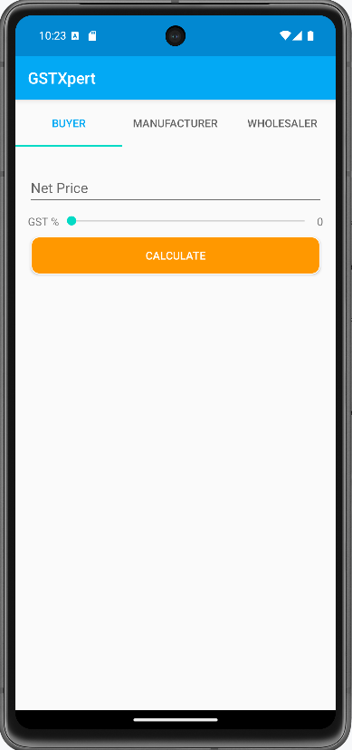
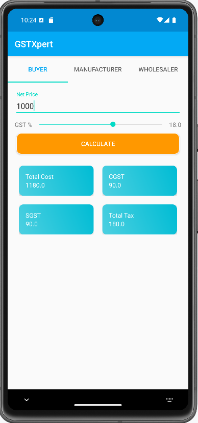
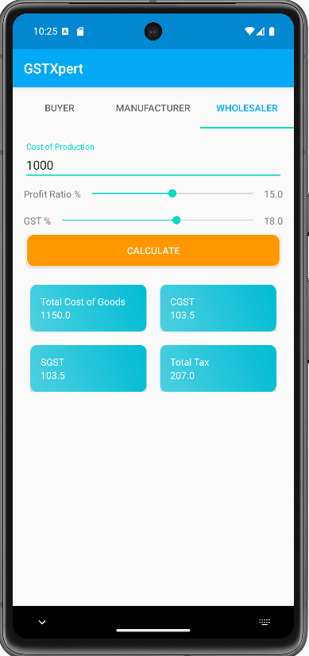

# GSTXpert Android App

GSTXpert is an Android application designed to provide users with easy access to different GST-related information. This app includes multiple fragments for different user roles: Buyers, Manufacturers, and Wholesalers. Users can navigate through these sections using tabs, and the app provides an intuitive interface for accessing various GST-related resources.

## Features

- Three main sections:
    - **Buyer**
    - **Manufacturer**
    - **Wholesaler**

- ViewPager for seamless navigation between tabs.
- TabLayout integration for smooth and user-friendly navigation.

## Screenshots

  
  
  
  

