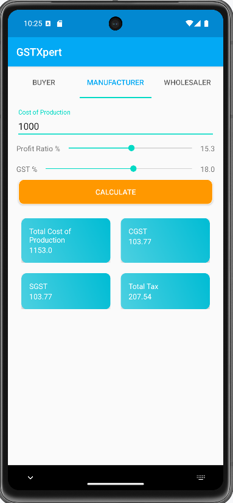

# GSTXpert - Your Ultimate GST Calculation Companion 📱

Welcome to **GSTXpert**, a powerful Android app designed to help users easily access and calculate Goods and Services Tax (GST) information. Whether you're a **Buyer**, **Manufacturer**, or **Wholesaler**, GSTXpert provides tailored features and tools for managing GST-related queries and calculations seamlessly.

With an intuitive user interface and multiple roles, GSTXpert makes it easy to stay compliant with GST regulations while offering a smooth and enjoyable user experience.

---

## **Key Features** 🌟

- **Role-Based Sections**:
  - **Buyer**: Access GST rates, tax credits, and calculate GST for purchases.
  - **Manufacturer**: Calculate GST for production, including tax calculations and profit margins.
  - **Wholesaler**: GST calculations for wholesale businesses, with detailed insights into costs, CGST, SGST, and tax calculations.

- **Smooth Navigation**:
  - **ViewPager & TabLayout** for fluid navigation across different sections.
  - Interactive **SeekBars** for adjusting GST and profit rates with real-time updates.

- **Real-Time GST Calculations**:
  - Quick and easy calculations for GST, CGST, SGST, and tax profits.
  - Personalized calculations based on user inputs, displayed on intuitive card layouts.

- **Educational Resources**:
  - Integrated with useful **FAQs**, **Tips**, and **Guides** to help users better understand GST regulations.

---

## **Screenshots** 📸

Here are a few screenshots of the app showcasing its intuitive design and user-friendly navigation:

|  |  |  |  |
| -------------------------------------- | -------------------------------------- | -------------------------------------- | -------------------------------------- |

